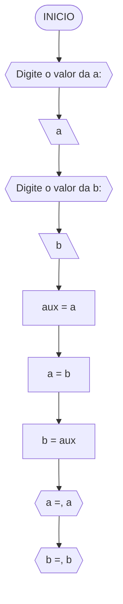

#### Fluxograma



#### Pseudocódigo (1 ponto)

```java
ALGORTIMO TrocaValores
DECLARE a,b,axu: REAL

INICIO

    // Insira seu comentário
    ESCREVA "Digite o valor da a:"

    // Insira seu comentário
    LEIA a

    // Insira seu comentário
    ESCREVA "Digite o valor da b:"

    // Insira seu comentário
    LEIA b

    // Insira seu comentário
    aux <- a 

    // Insira seu comentário
    a <- b

    // Insira seu comentário
    b <- aux

    // Insira seu comentário
    ESCREVA "a=", a
    ESCREVA "b=", b

FIM
```

#### Tabela de testes

| a  | b  | aux | a  | b  | saída 1 | saída 2 | 
| -- | -- | --  | -- | -- | --      | --      | 
| 0  | 1  | 0   | 1  | 0  | a = 1   | b = 0   |

