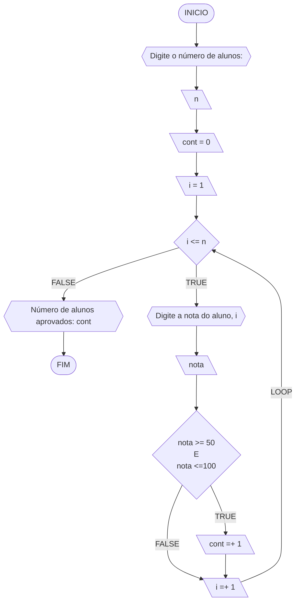
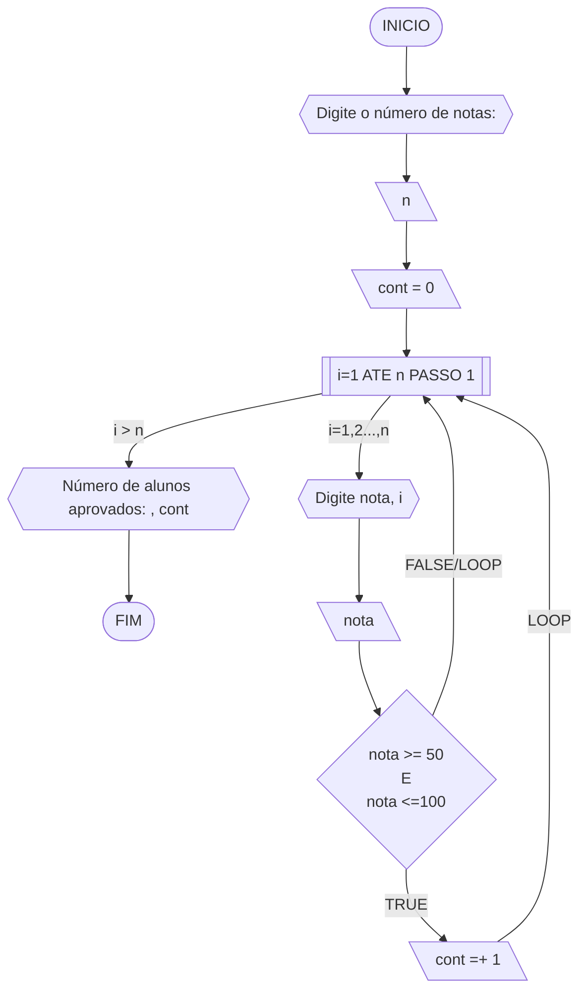

#### Fluxograma 01
Fluxograma conforme descrição do algoritmo acima, usando o loop ENQUANTO.



#### Fluxograma 02
Fluxograma opcional usando o loop PARA.



#### Pseudocódigo 01 (1 ponto)

```java
ALGORTIMO ContaAprovacoes
DECLARE n, cont, nota, i: INTEIRO

INICIO

    // Insira seu comentário
    ESCREVA "Digite a quantidade de notas dos alunos:"

    // Insira seu comentário
    LEIA n

    // Insira seu comentário
    cont = 0 

    // Insira seu comentário
    PARA i DE 1 ATE n FAÇA

        // Insira seu comentário
        ESCREVA "Digite a nota do aluno", i, ":"

        // Insira seu comentário
        LEIA nota

        // Insira seu comentário
        SE nota >= 50 E nota <= 100 ENTAO

            // Insira seu comentário
            cont = cont + 1 

        FIM_SE

    FIM_PARA

    // Insira seu comentário
    ESCREVA "O numero de alunos aprovados e:", cont

FIM
```

#### Tabela de testes 01
Tabela de testes referente ao algoritmo usando o loop ENQUANTO.

| it | n  | i  | cont | i<=n  | nota, i | nota | nota_valida | cont+1 | i+1 | saída        | 
| -- | -- | -- | --   | --    | --      | --   | --          | --     | --  | --           |
| 1  | 3  | 1  |  0   | True  | nota 1  | 60   | True        | 1      | 2   |              |
| 2  | 3  | 2  |  1   | True  | nota 2  | 40   | False       | 1      | 3   |              |
| 3  | 3  | 3  |  1   | True  | nota 3  | 90   | True        | 2      | 4   |              |
| 4  | 3  | 4  |  2   | False |         |      |             |        |     | Aprovados: 2 |

#### Tabela de testes 02
Tabela de testes referente ao algoritmo usando o loop PARA.

| it | n  | cont | i  | nota, i | nota | nota_valida | cont+1 | saída        | 
| -- | -- | --   | -- | --      | --   | --          | --     | --           |
| 1  | 3  | 0    | 1  | nota 1  | 60   | True        | 1      |              |
| 2  | 3  | 1    | 2  | nota 2  | 40   | False       | 1      |              |
| 3  | 3  | 1    | 3  | nota 3  | 90   | True        | 2      | Aprovados: 2 |
