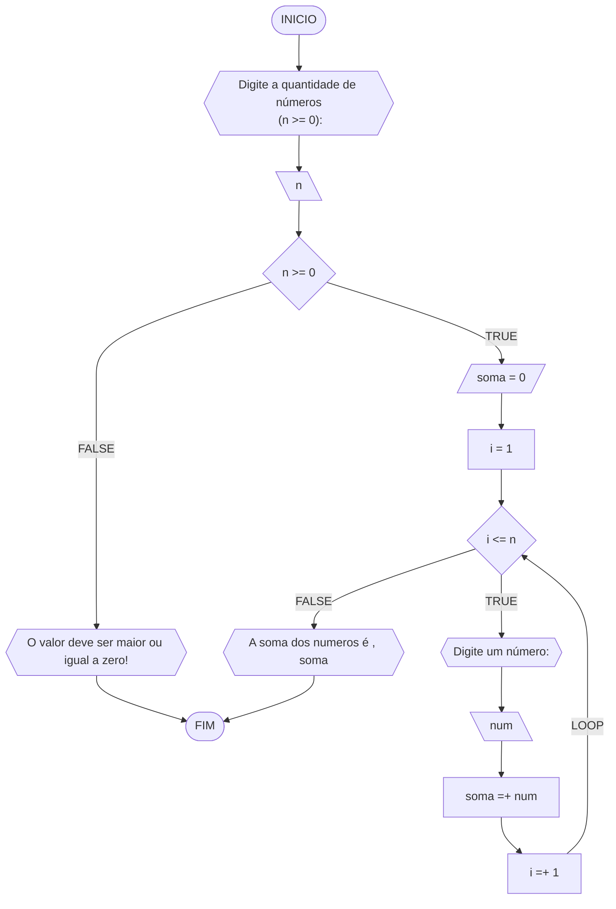

#### Fluxograma



#### Pseudocódigo (1 ponto)

```java
Algoritmo SomaNumeros
DECLARE n,i,soma: INTEIRO

INICIO

    // Insira seu comentário
    ESCREVA "Digite a quantidade de números<br> (n >= 0):"
    LEIA n

    // Insira seu comentário
    SE n >=0 ENTAO

        // Insira seu comentário
        soma <- 0

        // Insira seu comentário
        i <- i

        // Insira seu comentário
        ENQUANTO i <= n FAÇA

            // Insira seu comentário
            ESCREVA "Digite um número:"

            // Insira seu comentário
            LEIA num 

            // Insira seu comentário
            soma <- soma + num

            // Insira seu comentário
            i <- i + 1

        FIM_ENQUANTO

    // Insira seu comentário
    SENAO
        "O valor deve ser maior ou igual a zero!"

    FIM_SE

    // Insira seu comentário
    ESCREVA "A soma dos numeros é , soma"

FIM
```

#### Tabela de testes

| it | n  | n >= 0 | soma | i  | i <= n | num | soma =+ num  | saída                   |
| -- | -- | --     | --   | -- | --     | --  | --           | --                      |
|    | -3 | False  |      |    |        |     |              | O valor deve ser ...    |
| 1  | 0  | True   | 0    | 1  | False  |     |              | A soma dos números é 0  |
| 1  | 3  | True   | 0    | 1  | True   | 5   | 0 + 5 = 5    |                         |
| 2  | 3  | True   | 5    | 2  | True   | 10  | 5 + 10 = 15  |                         |
| 3  | 3  | True   | 15   | 3  | True   | 20  | 15 + 20 = 35 |                         |
| 4  | 3  | True   | 35   | 4  | False  |     |              | A soma dos números é 35 |
