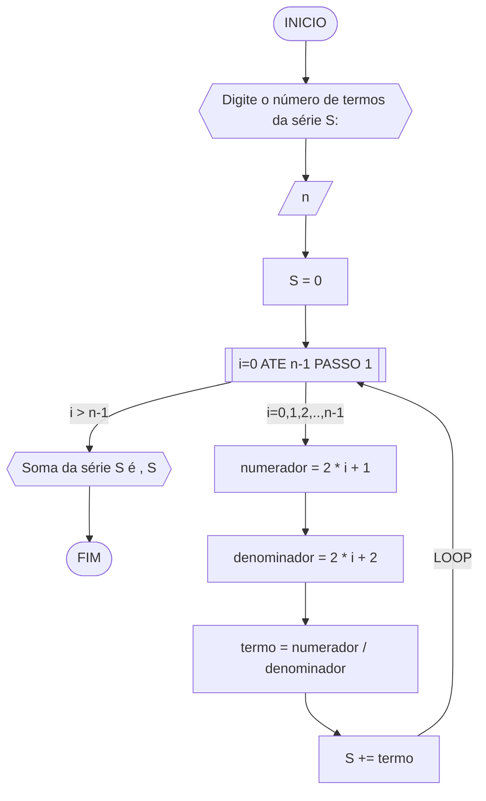

#### Fluxograma



#### Pseudocódigo (1 ponto)

```java
Algoritmo SomaSerie
DECLARE n,numerador,denominador: INTEIRO; termo, S: REAL

INICIO

    // Insira seu comentário
    ESCREVA "Digite o número de termos da série S:"

    // Insira seu comentário
    LEIA n

    // Insira seu comentário
    S <- 0

    // Insira seu comentário
    PARA i de 0 ATÉ n-1 PASSO 1 FAÇA

        // Insira seu comentário
        numerador = 2 * i + 1

        // Insira seu comentário
        denominador <- 2 * i + 2

        // Insira seu comentário
        termo = numerador / denominador

        // Insira seu comentário
        S += termo

    FIM_PARA

    // Insira seu comentário
    ESCREVA "Soma da série S é ", S

FIM
```

#### Tabela de testes (0.25 ponto)

| it | n  | S  | i | numerador | denominador | termo | S += termo     | saída                  |
| -- | -- | -- |-- | --        | --          | --    | --             | --                     |
|    | 0  | 0  |   |           |             |       |                |                        |
| 1  | 4  | 0  | 0 | 2*0+1 = 1 | 2*0+2 = 2   | 1/2   | 0+1/2 = 1/2    |                        |
| 2  | 4  | 0  | 1 | 2*1+1 = 1 | 2*1+2 = 2   | 3/4   | 1/2+3/4 = 1.25 |                        |
| 3  | 4  | 0  | 2 | 2*2+1 = 1 | 2*2+2 = 2   | 5/6   | 0+1/2 = 2.08   |                        |
| 4  | 4  | 0  | 3 | 2*3+1 = 1 | 2*3+2 = 2   | 7/8   | 0+1/2 = 2.96   | Soma da série S é 2.96 |
