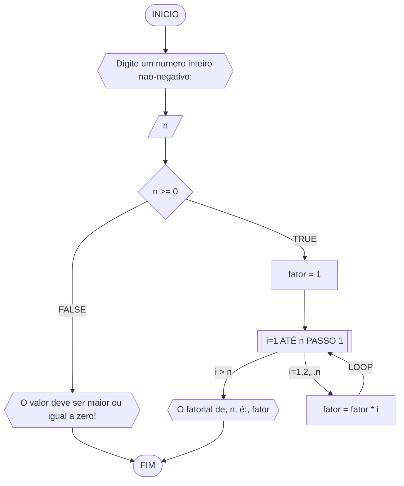

#### Fluxograma



#### Pseudocódigo (2 pontos)

```java
ALGORITMO CalcFatorial
DECLARE n: INTEIRO

INICIO

    // Insira seu comentário
    ESCREVA "Digite um numero inteiro nao-negativo:"

    // Insira seu comentário
    LEIA n

    // Insira seu comentário
    SE n >= 0 ENTAO

        // Insira seu comentário
        fator <- 1

        // Insira seu comentário
        PARA i DE 1 ATÉ n PASSO 1 FAÇA

            // Insira seu comentário
            fator <- fator * i        // fator *= i

        FIM_PARA

        // Insira seu comentário
        ESCREVA "O fatorial de, n, é:", fator

    // Insira seu comentário
    SENAO
        ESCREVA "O valor deve ser maior ou igual a zero!"
    FIM_SE

FIM
```

#### Tabela de testes

| n  | fator | i  | fator = fator * i | saída               |
| -- | --    | -- | --                | --                  |
| 3  | 1     | 1  | 1*1 = 1           |                     |
| 3  | 1     | 2  | 1*2 = 2           |                     |
| 3  | 2     | 3  | 2*3 = 6           | O fatorial de 3 é 6 |
