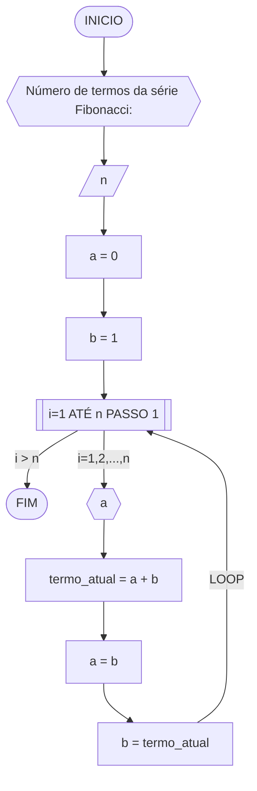

#### Fluxograma



#### Pseudocódigo (2 pontos)

```java
ALGORITMO GeraFibonacci
DECLARE n, a, b, termo_atual: INTEIRO

INICIO

    // Solicita ao usuário o número de termos desejado para a série Fibonacci
    ESCREVA "Número de termos da série Fibonacci:"

    // Lê o número de termos fornecido pelo usuário e armazena na variável "n"
    LEIA n

    // Inicializa o primeiro termo da série Fibonacci com 0
    a <- 0

    // Inicializa o segundo termo da série Fibonacci com 1
    b <- 1

    // Loop para calcular e exibir os termos da série Fibonacci
    PARA i DE 1 ATE n FAÇA

        // Exibe o termo atual da série Fibonacci
        ESCREVA a

        // Calcula o próximo termo da série Fibonacci
        termo_atual <- a + b

        // Atualiza os valores dos termos anteriores para os próximos termos
        a <- b
        b <- termo_atual

    FIM_PARA

FIM

```
#### Tabela de testes

| it | n  | a  | b  | i  | saída | termo_atual = a + b | a = b | b = termo_atual |
| -- | -- | -- | -- | -- | --    | --                  | --    | --              |
| 1  | 5  | 0  | 1  | 1  | 0     | 0 + 1 = 1           | 1     | 1               |
| 2  | 5  | 1  | 1  | 2  | 1     | 1 + 1 = 2           | 1     | 2               |
| 3  | 5  | 1  | 2  | 3  | 1     | 1 + 2 = 3           | 2     | 3               |
| 4  | 5  | 2  | 3  | 4  | 2     | 2 + 3 = 5           | 3     | 5               |
| 4  | 5  | 3  | 5  | 5  | 3     | 3 + 5 = 8           | 5     | 8               |
