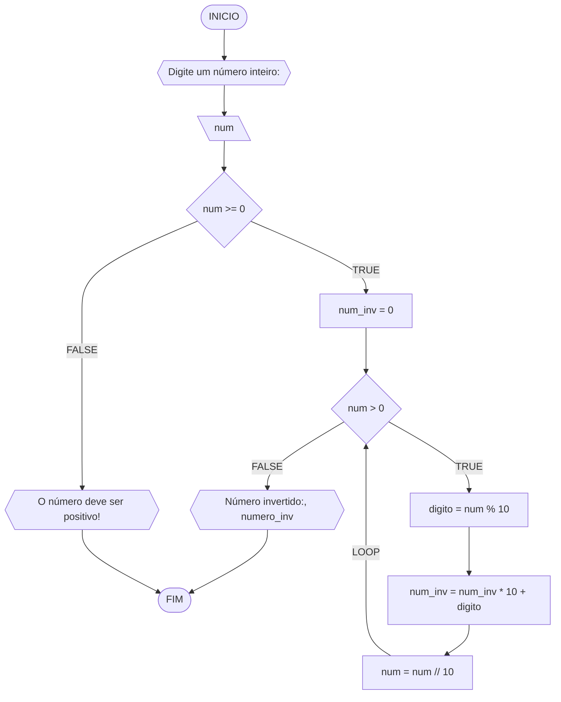

#### Fluxograma



#### Pseudocódigo (2 pontos)

```java
Algoritmo InverteInteiro
DECLARE num, num_inv, digito: INTEIRO

INICIO

    // Solicita ao usuário que digite o número a ser invertido
    ESCREVA "Digite o número a ser invertido:"
    LEIA num

    // Verifica se o número é negativo
    SE num < 0 ENTAO

        // Informa ao usuário que o número deve ser positivo
        ESCREVA "O número deve ser positivo!"

    // Se o número é positivo
    SENAO

        // Inicializa a variável para armazenar o número invertido
        num_inv <- 0

        // Loop para inverter o número
        ENQUANTO num > 0 FAÇA

            // Obtém o último dígito do número
            digito <- num % 10

            // Adiciona o dígito obtido ao número invertido
            num_inv <- (num_inv * 10) + digito

            // Remove o último dígito do número original
            num <- num // 10

        // Exibe o número invertido
        ESCREVA "Número invertido:", num_inv

    FIM_SE

FIM
```

#### Tabela de testes

| it | num | num_inv | num > 0 | digito | num = num // 10 | num_inv = (num_inv * 10) + digito | Saída                        |
| -- | --  | --      | --     | --      | --              | --                                | --                           |
|    | -1  | 0       | False  |         |                 |                                   | O número deve ser positivo!  |
| 1  | 0   | 0       | False  |         |                 |                                   | Número invertido:: 0         |
| 1  | 42  | 0       | True   | 2       | 4               | 2                                 |                              |
| 2  | 4   | 2       | True   | 4       | 0               | 24                                |                              |
| 3  | 0   | 24      | False  |         |                 |                                   | Número invertido:: 24        |
