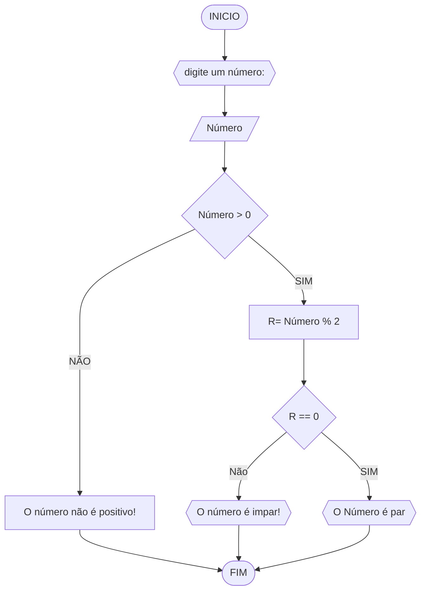

# UNIFOR
**Nome**: Juan Doth
**Disciplina**: Raciocínio logico algorítmico

##EXERCÍCIO 3
###Fluxograma

#### Pseudocódigo
```java
ALGORTIMO verifica_par_impar
DECLARE numero, resto: INTEIRO

INICIO

    // Insira seu comentário
    ESCREVA "Digite um número: "
    
    // Insira seu comentário
    LEIA numero
    
    // Insira seu comentário
    SE numero >= 0 ENTAO

        // Insira seu comentário
        resto <- numero % 2

        // Insira seu comentário
        SE resto == 0 ENTAO
            ESCREVA "O número é par!"

        // Insira seu comentário
        SENAO
          ESCREVA "O número é impar!"

        FIM_SE

    // Insira seu comentário
    SENAO             
        ESCREVA "O número deve ser postivo!"

    FIM_SE

FIM
```


#### Tabela de testes
| numero | numero >= 0 | resto | resto == 0 | Saída |
| -- | -- | -- | -- | -- | 
| -1 | F |   |   | "O número deve ser postivo!" |
| 0  | V | 0 | V | "O número é par!" |
| 13 | V | 1 | F | "O número é impar!" |
| 30 | V | 0 | V | "O número é par!" |
