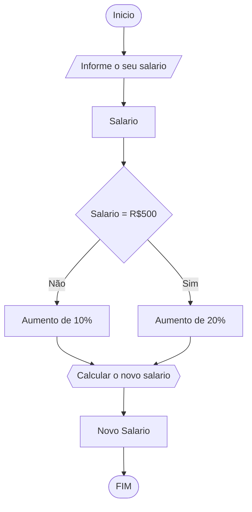

# UNIFOR
**Nome**: Juan Doth
**Disciplina**: Raciocínio logico algorítmico

##Questão 2
###Fluxograma

#### Pseudocódigo (1.0 ponto)

```java
ALGORTIMO ReajusteSalario
DECLARE sal_atual, sal_reaj: REAL

INICIO

    // Insira seu comentário
    ESCREVA "Digite seu salário atual:"

    // Insira seu comentário
    LEIA sal_atual

    // Insira seu comentário
    SE sal_atual <= 500 ENTAO
        sal_reaj = sal_atual * 1.2

    // Insira seu comentário
    SENAO
        sal_reaj = sal_atual * 1.1

    FIM_SE

    // Insira seu comentário
    ESCREVA "O novo salário é R$", sal_reaj

FIM
```

#### Tabela de testes (1.0 ponto)

| sal_atual | sal_atual >= 500 |sal_reaj       | saída                   | 
| --        | --               | --            | --                      | 
| 400       | False            | 400*1.2 = 480 | O novo salário é R$ 480 |
| 500       | True             | 500*1.2 = 600 | O novo salário é R$ 600 |
| 600       | True             | 600*1.1 = 660 | O novo salário é R$ 660 |
