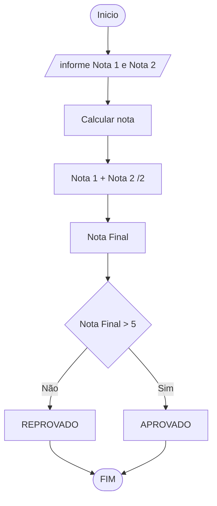

# UNIFOR
**Nome**: Juan Doth
**Disciplina**: Raciocínio logico algorítmico

##Questão 2
###Fluxograma

#### Pseudocódigo (1 ponto)

```java
ALGORTIMO SituacaoAluno
DECLARE nota1, nota2, media: REAL

 // Solicita que o usuário insira a nota 1
    ESCREVA "Digite a nota 1:"

    // Lê a nota 1 inserida pelo usuário
    LEIA nota1

    // Solicita que o usuário insira a nota 2
    ESCREVA "Digite a nota 2:"

    // Lê a nota 2 inserida pelo usuário
    LEIA nota2

    // Verifica se ambas as notas são maiores ou iguais a zero
    SE nota1 >= 0 E nota2 >= 0 ENTAO

        // Calcula a média das notas
        media = (nota1 + nota2) / 2

        // Verifica se a média é maior ou igual a 7
        SE media >= 7 ENTAO
            // Informa que o aluno está aprovado
            ESCREVA "O aluno está aprovado!"

        // Caso contrário
        SENAO
            // Informa que o aluno está reprovado
            ESCREVA "O aluno está reprovado!"

        FIM_SE

    // Se alguma das notas não for maior ou igual a zero
    SENAO
        // Informa que a nota deve ser maior que zero
        ESCREVA "A nota deve ser maior que zero!"

    FIM_SE

FIM

FIM
```

#### Tabela de testes (1 ponto)

| nota1 | nota2 | nota1 >= 0 E nota2 >= 0 | media        | saĩda | 
| --    | --    | --                      | --           | --    | 
| -1    | 0     | False                   |              | A nota deve ser maior que zero! | 
| 0     | 0     | True                    | (0+0)/2 = 0  | O aluno está reprovado!|
| 4     | 8     | True                    | (4+8)/2 = 6  | O aluno está reprovado!|
| 4     | 10    | True                    | (4+10)/2 = 7 | O aluno está aprovado!|
