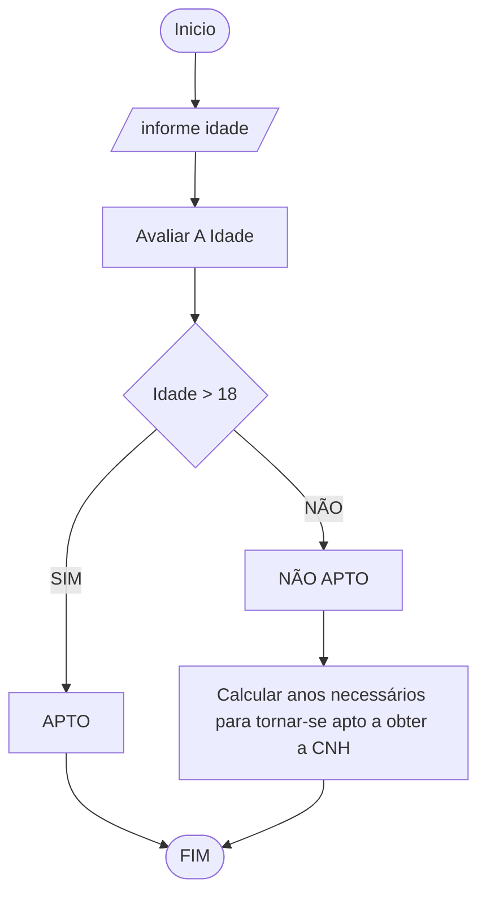

# UNIFOR
**Nome**: Juan Doth
**Disciplina**: Raciocínio logico algorítmico

##Questão 2
###Fluxograma

#### Pseudocódigo (1.0 ponto)

```java
ALGORTIMO AptoCNH
DECLARE idade, anos_apto: INTEIRO

INICIO

    // Insira seu comentário
    ESCREVA ""Digite a sua idade:"

    // Insira seu comentário
    LEIA idade

    // Insira seu comentário
    SE idade < 0 ENTAO
        ESCREVA "A idade deve ser maior que zero!"

    // Insira seu comentário
    SENAO

        // Insira seu comentário
        SE idade >= 18 ENTAO
            ESCREVA "O candidato está apto a tirar a CNH!"

        // Insira seu comentário
        SENAO

            // Insira seu comentário
            anos_apto <- 18 - idade

            // Insira seu comentário
            ESCREVA "Faltam", anos_apto, "ano(s) para o candidato estar apto!"

        FIM_SE

    FIM_SE

FIM
```

#### Tabela de testes (1.0 ponto)

| idade | idade < 0 | idade >= 18 | anos_apto | saída                                         | 
| --    | --        | --          | --        | --                                            | 
| -1    | True      |             |           |                                               |
| 0     | False     | False       | 18-0 = 18 | Faltam 18 ano(s) para o candidato estar apto! |
| 17    | False     | False       | 18-17 = 1 | Faltam 1 ano(s) para o candidato estar apto!  |
| 18    | False     | True        |           | O candidato está apto a tirar a CNH!          |
