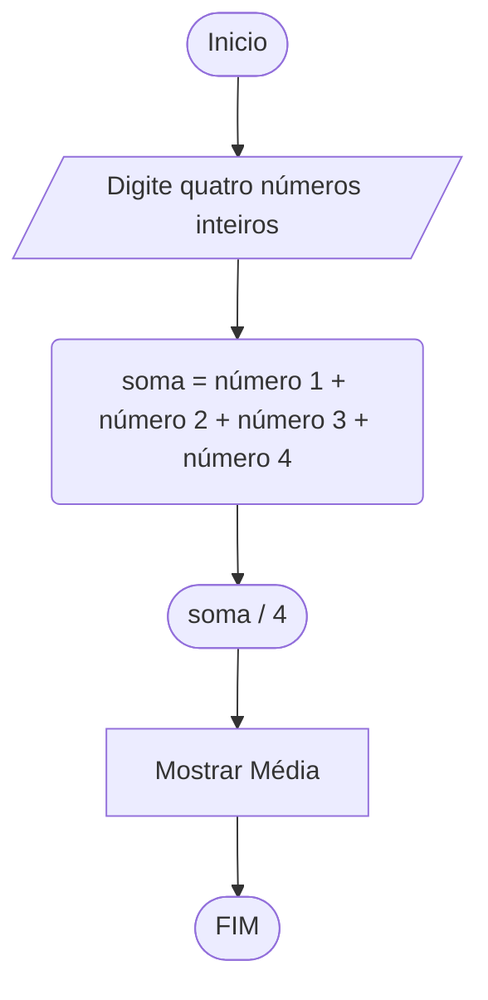

# UNIFOR
**Nome**: Juan Doth
**Disciplina**: Raciocínio logico algorítmico

##Questão 1
###Fluxograma

#### Pseudocódigo (1.0 ponto)

```java
ALGORTIMO Media
DECLARE num1, num2, num3, num4: REAL

INICIO

    // Solicita que o usuário insira o número 1
    ESCREVA "Digite o número 1:"

    // Lê o número 1 inserido pelo usuário
    LEIA num1

    // Solicita que o usuário insira o número 2
    ESCREVA "Digite o número 2:"

    // Lê o número 2 inserido pelo usuário
    LEIA num2

    // Solicita que o usuário insira o número 3
    ESCREVA "Digite o número 3:"

    // Lê o número 3 inserido pelo usuário
    LEIA num3

    // Solicita que o usuário insira o número 4
    ESCREVA "Digite o número 4:"

    // Lê o número 4 inserido pelo usuário
    LEIA num4

    // Calcula a média dos quatro números
    media <- (num1 + num2 + num3 + num4)/4
    
    // Mostra a média calculada
    ESCREVA "A média é", media

FIM
```

#### Teste de mesa (0.5 ponto)

| num1 | num2 | num3 | num4 | saída | 
| --   | --   | --   | --   | --    | 
| 0.25 | 0.25 | 2.50 | 1.00 | 1.00  | 
