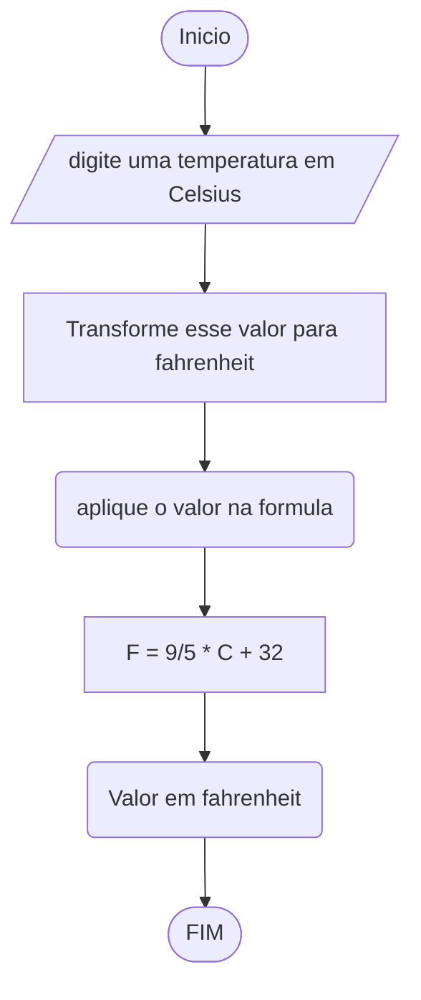

# UNIFOR
**Nome**: Juan Doth
**Disciplina**: Raciocínio logico algorítmico

##Questão 2
###Fluxograma

#### Pseudocódigo (1.0 ponto)

```java
ALGORTIMO ConverteCelsiusFarenheit
DECLARE C, F: REAL

INICIO

    // Insira seu comentário
    ESCREVA "Digite a temperatura em Celisus:"

    // Insira seu comentário
    LEIA C

    // Insira seu comentário
    F <- (9/5) * C + 32

    // Insira seu comentário
    ESCREVA "A temperatura em Fahrenheit é", F, "graus"

FIM
```

#### Teste de mesa (0.5 ponto)

| C  | F  | saída                                  | 
| -- | -- | --                                     |
| 0  | 32 | A temperatura em Fahrenheit é 32 graus |
