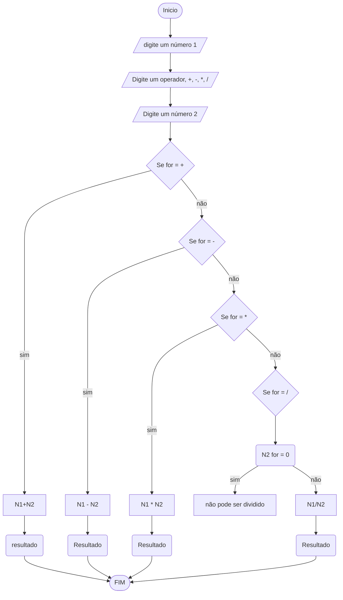

# UNIFOR
**Nome**: Juan Doth
**Disciplina**: Raciocínio logico algorítmico

##Questão 3
###Fluxograma

#### Pseudocódigo (1.0 ponto)

```java
ALGORITMO CalculadoraSimples
DECLARE op: INTEIRO; num1,num2,res: REAL

INICIO

    // Informa as operações válidas ao usuário
    ESCREVA "Operações válidas: 1(soma), 2(subtração), 3(multiplicação) e 4(divisão)"

    // Solicita que o usuário digite uma operação
    ESCREVA "Digite uma operação:"
    
    // Lê a operação inserida pelo usuário
    LEIA op

    // Solicita que o usuário digite um número
    ESCREVA "Digite um número:"
    
    // Lê o primeiro número inserido pelo usuário
    LEIA num1

    // Solicita que o usuário digite outro número
    ESCREVA "Digite outro número:"
    
    // Lê o segundo número inserido pelo usuário
    LEIA num2

    // Executa a escolha de acordo com a operação inserida
    ESCOLHA

        // Caso a operação seja soma
        CASO op == 1

            // Realiza a soma e armazena o resultado em 'res'
            res = num1 + num2

            // Mostra a operação e o resultado
            ESCREVA num1, "+", num2, "=", res

        // Caso a operação seja subtração
        CASO op == 2

            // Realiza a subtração e armazena o resultado em 'res'
            res = num1 - num2

            // Mostra a operação e o resultado
            ESCREVA num1, "-", num2, "=", res

        // Caso a operação seja multiplicação
        CASO op == 3

            // Realiza a multiplicação e armazena o resultado em 'res'
            res = num1 * num2

            // Mostra a operação e o resultado
            ESCREVA num1, "*", num2, "=", res

        // Caso a operação seja divisão
        CASO op == 4

            // Verifica se o segundo número é diferente de zero
            SE num2 != 0 ENTAO

                // Realiza a divisão e armazena o resultado em 'res'
                res = num1 / num2

                // Mostra a operação e o resultado
                ESCREVA num1, "/", num2, "=", res

            // Caso o segundo número seja zero
            SENAO
                // Informa que é impossível dividir por zero
                ESCREVA "Impossível dividir!"

            FIM_SE

    // Caso a operação inserida seja inválida
    SENAO
        // Informa que a operação é inválida
        ESCREVA "Operação inválida!"

    FIM_ESCOLHA

FIM
```

#### Teste de mesa (0.5 ponto)

| num1 | num2 | op | num2 != 0 | res | saída               | 
| --   | --   | -- | --        | --  | --                  |
| 1    | 0    | 1  |           | 1   | 1 + 0 = 1           |
| 1    | 0    | 2  |           | 1   | 1 - 0 = 1           |
| 1    | 0    | 3  |           | 0   | 1 * 0 = 0           |
| 1    | 0    | 4  | False     |     | Impossível dividir! |
| 1    | 2    | 4  | True      | 0.5 | 1 / 2 = 0,5         |
| 1    | 2    | 5  |           |     | Operação inválida!  |
