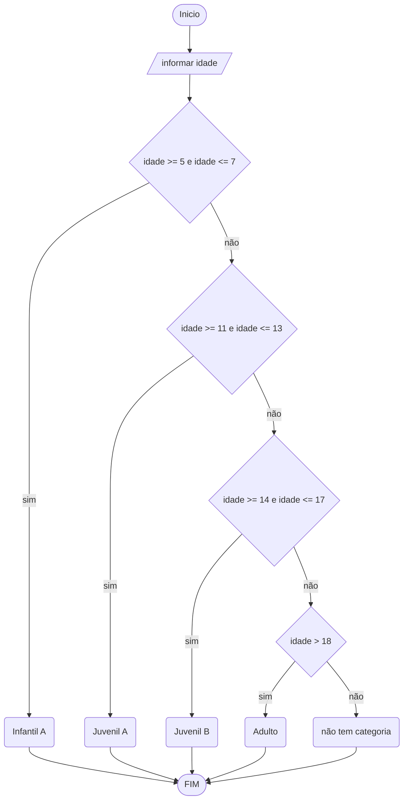

# UNIFOR
**Nome**: Juan Doth
**Disciplina**: Raciocínio logico algorítmico

##Questão 4
###Fluxograma

#### Pseudocódigo (1.0 ponto)

```
ALGORTIMO ClassificaCategoria
DECLARE idade: INTEIRO

INICIO

    // Solicita que o usuário digite a idade do aluno
    ESCREVA "Digite a idade do aluno:"

    // Lê a idade inserida pelo usuário
    LEIA idade

    // Realiza a escolha com base na idade do aluno
    ESCOLHA

        // Caso a idade esteja entre 5 e 7 anos
        CASO idade >= 5 E idade <= 7

            // Informa que o aluno pertence à categoria Infantil A
            ESCREVA "Infantil A"

        // Caso a idade esteja entre 8 e 10 anos
        CASO idade >= 8 E idade <= 10

            // Informa que o aluno pertence à categoria Infantil B
            ESCREVA "Infantil B"

        // Caso a idade esteja entre 11 e 13 anos
        CASO idade >= 11 E idade <= 13

            // Informa que o aluno pertence à categoria Juvenil A
            ESCREVA "Juvenil A"

        // Caso a idade esteja entre 14 e 17 anos
        CASO idade >= 14 E idade <= 17

            // Informa que o aluno pertence à categoria Juvenil B
            ESCREVA "Juvenil B"

        // Caso a idade seja 18 anos ou mais
        CASO idade >= 18

            // Informa que o aluno pertence à categoria Adulto
            ESCREVA "Adulto"

    // Caso a idade inserida seja inválida (menor que 5 anos)
    SENAO

        // Informa que a idade inserida não é válida
        ESCREVA "Digite uma idade válida!"

    FIM_ESCOLHA

FIM
```

#### Teste de mesa (0.5 ponto)

| idade | idade >=8 E idade <= 10 | idade >=11 E idade <= 13 | idade >=14 E idade <= 17 | idade >=18 | saída                       | 
| --    | --                      | --                       | --                       | --         | --                          |
| 4     | False                   | False                    | False                    | False      | Digite uma idade válida!    |
| -4    | False                   | False                    | False                    | False      | Digite uma idade válida!    |
| 8     | True                    | False                    | False                    | False      | Infantial A                 |
| 11    | False                   | True                     | False                    | False      | Infantial B                 |
| 17    | False                   | False                    | True                     | False      | Infantial C                 |
| 21    | False                   | False                    | False                    | True       | Adulto                      |
