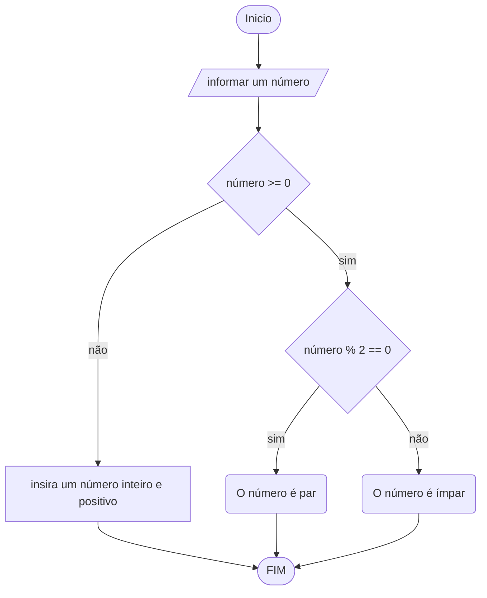

# UNIFOR
**Nome**: Juan Doth
**Disciplina**: Raciocínio logico algorítmico

##Questão 4
###Fluxograma

#### Pseudocódigo (1.0 ponto)

```java
ALGORTIMO verifica_par_impar
DECLARE num, resto: INTEIRO

INICIO

    // Solicita que o usuário digite um número inteiro
    ESCREVA "Digite um número: "

    // Armazena o número digitado pelo usuário na variável "num"
    LEIA num

    // Loop condicional (while) que continua enquanto "num" for menor que zero
    ENQUANTO num < 0 FAÇA

        // Solicita que o usuário digite um número maior ou igual a zero
        ESCREVA "Digite um número maior ou igual a zero:"

        // Armazena um novo número digitado pelo usuário na variável "num"
        LEIA num

    FIM_ENQUANTO

    // Verifica se o número é maior ou igual a zero
    SE num >= 0 ENTAO

        // Calcula o resto da divisão de "num" por 2
        resto ← num % 2

        // Verifica se o resto da divisão por 2 é igual a zero (se o número é par)
        SE resto == 0 ENTAO
            ESCREVA "O número é par!"

        // Se o resto da divisão por 2 não é zero, então o número é ímpar
        SENAO
            ESCREVA "O número é ímpar!"

        FIM_SE

    // Se o número for negativo
    SENAO
        ESCREVA "O número deve ser positivo!"

    FIM_SE

FIM
```

#### Tabela de testes (0.5 ponto)

| num | num < 0 | num | resto | resto == 0 | saída             | 
| --  | --      | --  | --    | --         | --                | 
| -1  | True    | 0   | 0     | True       | O número é par!   |
| 1   | False   |     | 1     | False      | O número é impar! |
| 2   | False   |     | 0     | True       | O número é par!   |
