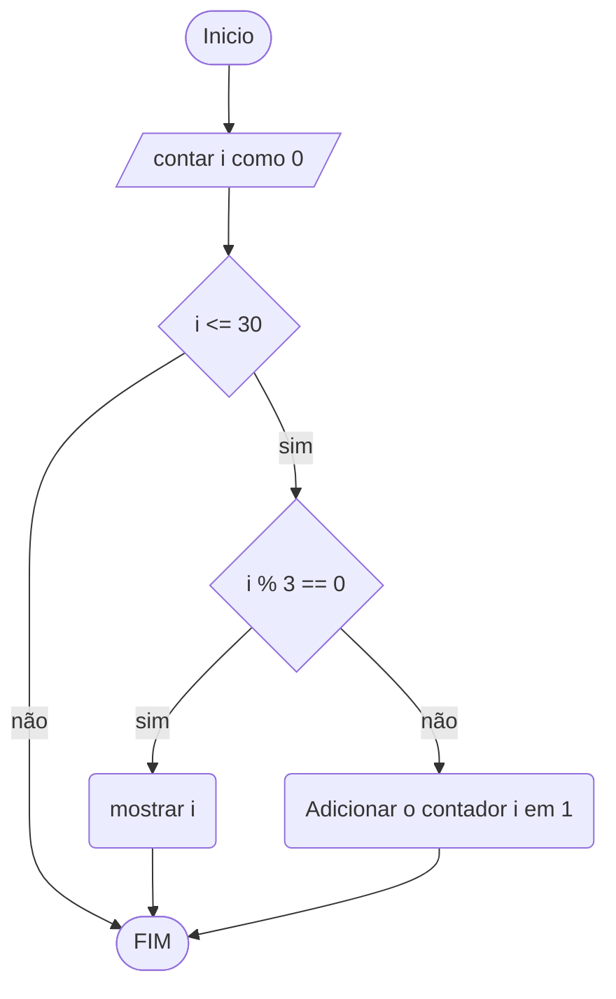

# UNIFOR
**Nome**: Juan Doth
**Disciplina**: Raciocínio logico algorítmico

##Questão 2
###Fluxograma

```mermaid
flowchart TD
A([Inicio]) --> B[/contar i como 0/]
B --> C{i <= 30}
C -- sim --> D{i % 3 == 0}
D -- sim --> F(mostrar i)
C -- não -->G([FIM])
D -- não --> H(Adicionar o contador i em 1)
F --> G
H --> G
```
