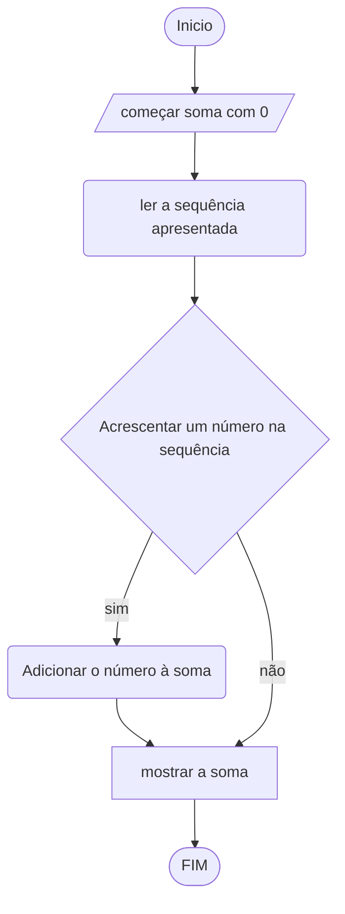

# UNIFOR
**Nome**: Juan Doth
**Disciplina**: Raciocínio logico algorítmico

##Questão 3
###Fluxograma

```mermaid
flowchart TD
A([Inicio]) --> B[/começar soma com 0/]
B --> F(ler a sequência apresentada)
F --> C{ Acrescentar um número na sequência}
C -- sim -->D(Adicionar o número à soma)
D --> E
C --não --> E[mostrar a soma]
E --> G([FIM])
```
