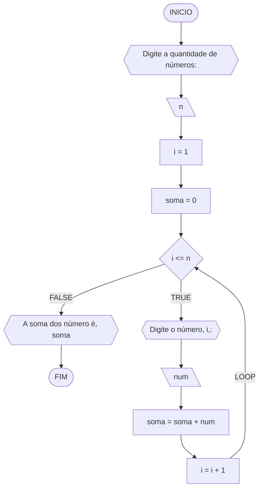
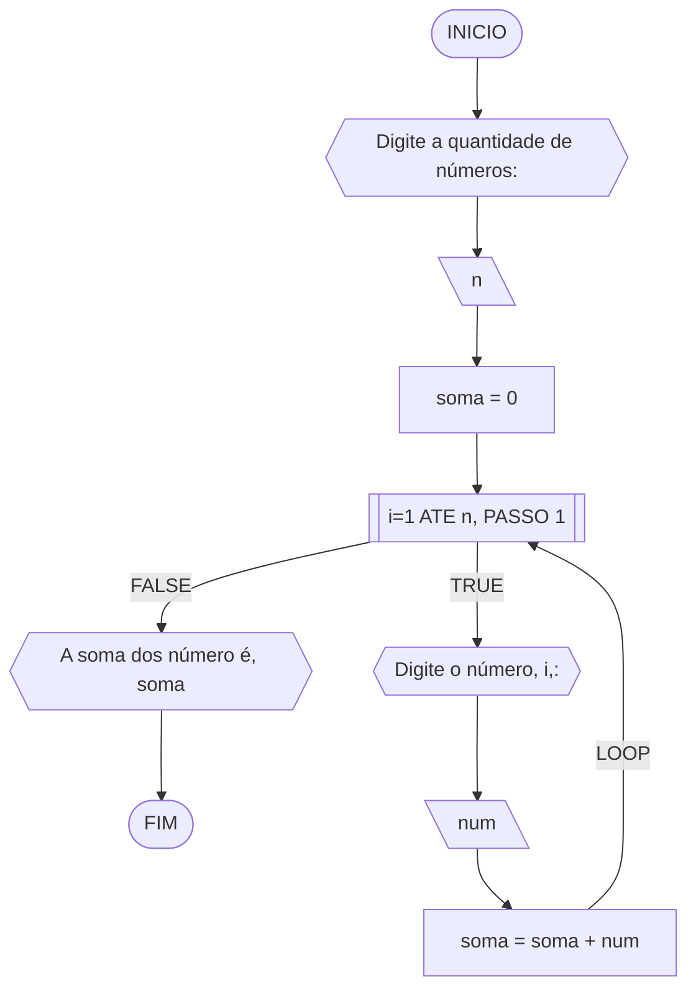

# UNIFOR
**Nome**: Juan Doth
**Disciplina**: Raciocínio logico algorítmico

##Questão 3
#### Fluxograma 1



#### Fluxograma 2


#### Pseudocódigo (1.0 ponto)

```java
ALGORITMO SomaValores
DECLARE n,i: INTEIRO; soma,num: REAL

INICIO

	// Dado de entrada armezenado na variável n
	ESCREVA "Digite a quantidade de números:"

	// Armazena o valor de entrada na variável "n"
	LEIA n

	// Inicializa a variável "soma" em 0
	soma <- 0

	// Inicializa a variável "i" em 1
	i <- 1

	// Loop condicional (loop while) executa as instruções enquanto a condição "i <= n" for verdadeira
	ENQUANTO i <= n FAÇA

		// Exibe a mensagem solictando o número em cada iteração
		ESCREVA "Digite o número", i,":"

		// Armazena o valor de entrada na variável "num"
		LEIA num

		// Incrementa "num" na variável "soma" em cada iteração
		soma <- soma + num

		// Incrementa 1 na variável "num" em cada iteração
		i <- i + 1

	FIM_ENQUANTO

	// Exibe a mensagem concatenando aos caracteres "A soma dos número é" com a variável "soma".
	ESCREVA "A soma dos número é", soma

FIM
```

#### Tabela de testes (0.5 ponto)

| n  | soma | i  | i <= n | num | soma + num | i + 1   | saída                      |  
| -- | --   | -- | --     | --  | --         | --      | --                         |
| -1 | 0    | 1  | False  |     |            |         | A soma dos número é 0      |
| 0  | 0    | 1  | False  |     |            |         | A soma dos número é 0      |
| 3  | 0    | 1  | True   | 10  | 0+10 = 10  | 1+1 = 2 |                            |
| 3  | 10   | 2  | True   | 20  | 10+20 = 30 | 2+1 = 3 |                            |
| 3  | 30   | 3  | True   | 30  | 30+30 = 60 | 3+1 = 4 |                            |
| 3  | 60   | 4  | False  |     |            |         | A soma dos número é 60     |
