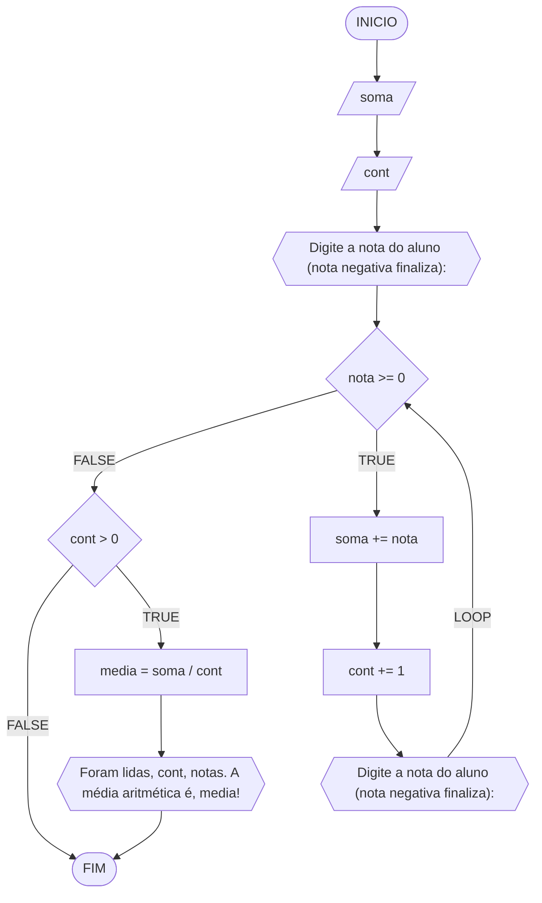

#### Fluxograma



#### Pseudocódigo

```java
ALGORTIMO QuantMedia
DECLARE nota, soma, media: REAL; cont: INTEIRO

INICIO
	
	// Solicita que o usuário insira a nota do aluno (uma nota negativa finaliza)
	ESCREVA "Digite a nota do aluno (nota negativa finaliza): "

	// Armazena o valor inserido pelo usuário na variável "nota"
	LEIA nota
	
	// Inicializa as variáveis "soma" e "cont"
	soma <- 0
	cont <- 0
	
	// Loop condicional (while) que executa as instruções enquanto a nota inserida for maior ou igual a zero
	ENQUANTO nota >= 0 FAÇA

		// Adiciona a nota à variável "soma" a cada iteração
		soma <- soma + nota

		// Incrementa 1 na variável "cont" a cada iteração
		cont <- cont + 1

		// Solicita uma nova nota ao usuário, uma nota negativa encerra o loop
		ESCREVA "Digite a nota do aluno (nota negativa finaliza): "

		// Armazena o valor inserido pelo usuário na variável "nota"
		LEIA nota

	FIM_ENQUANTO

	// Verifica se pelo menos uma nota foi inserida (para evitar divisão por zero)
	SE cont > 0 ENTÃO

		// Calcula a média das notas
		media <- soma / cont

		// Exibe a contagem e a média das notas
		ESCREVA "Foram lidas", cont, "nota(s). A média aritmética é", media

	FIM_SE

FIM
```

#### Tabela de testes

| it  | nota  | soma  | cont | nota >= 0 | soma + nota     | cont + 1 | nota    | cont > 0 | media          | saída                                            | 
| --  | --    | --    | --   | --        | --              | --       | --      | --       | --             | --                                               |
| 1   | -1.0  | 0.0   | 0    | False     |                 |          |         | False    |                |                                                  |

| it  | nota  | soma  | cont | nota >= 0 | soma + nota     | cont + 1 | nota    | cont > 0 | media          | saída                                            | 
| --  | --    | --    | --   | --        | --              | --       | --      | --       | --             | --                                               |
| 1   | 0.0   | 0.0   | 0    | True      | 0.0+0.0 = 0.0   | 0+1 = 1  | -1.0    |          |                |                                                  |
| 2   | -1.0  | 0.0   | 1    | False     |                 |          |         | True     | 0.0/1 = .0     | Foram lidas 1 nota(s). A média aritmética é 0.0! |

| it  | nota  | soma  | cont | nota >= 0 | soma + nota     | cont + 1 | nota    | cont > 0 | media          | saída                                            | 
| --  | --    | --    | --   | --        | --              | --       | --      | --       | --             | --                                               |
| 1   | 4.0   | 0.0   | 0    | True      | 0.0+4.0 = 4.0   | 0+1 = 1  | 8.0     |          |                |                                                  |
| 2   | 8.0   | 4.0   | 1    | True      | 4.0+8.0 = 12.0  | 1+1 = 2  | 6.0     |          |                |                                                  |
| 3   | 6.0   | 12.0  | 2    | True      | 12.0+6.0 = 18.0 | 2+1 = 3  | -8.0    |          |                |                                                  |
| 4   | -8.0  | 18.0  | 3    |           |                 |          |         | True     | 18.0/3.0 = 6.0 | Foram lidas 3 nota(s). A média aritmética é 6.0! |
